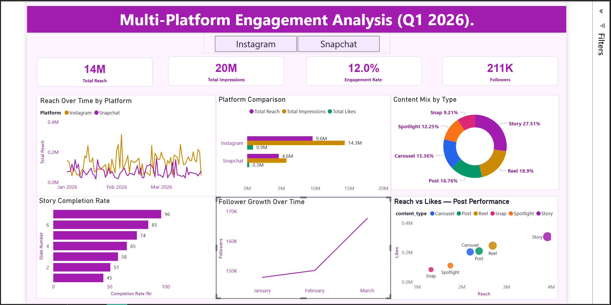

# 📊 Social Media Analytics Dashboard — Power BI

A professional, interactive Power BI dashboard for tracking **Snapchat** and **Instagram** performance metrics across reach, impressions, engagement rate, follower growth, story completion and content mix.

Built entirely from scratch as a learning and portfolio project — including mock dataset generation, data modeling, DAX measures and custom theme design.

---

## 🖼️ Dashboard Preview


---

## ✨ Features

- **Platform Slicer** — toggle between Instagram, Snapchat or combined view
- **4 KPI Cards** — Total Reach, Total Impressions, Engagement Rate, Followers
- **Reach Over Time** — dual-platform line chart across 85 days
- **Platform Comparison** — clustered bar chart comparing Snapchat vs Instagram
- **Content Mix** — donut chart showing breakdown by content type
- **Story Completion Rate** — bar chart showing drop-off across story slides
- **Follower Growth** — monthly trend line showing audience growth
- **Reach vs Likes Scatter Plot** — post performance analysis by content type
- **Neon Candy Theme** — custom purple, gold, green and blue color palette

---

## 🗂️ Project Structure

```
social-media-analytics-dashboard/
│
├── Social_Media_Dashboard.pbix        # Power BI dashboard file
├── social_media_powerbi.xlsx          # Mock Excel dataset (4 sheets)
├── SocialAnalytics_PowerBI_Theme.json # Custom Power BI theme file
├── dashboard_preview.png              # Dashboard screenshot
└── README.md                          # This file
```

---

## 📁 Data Model

The dataset is structured as a **star schema** with 4 tables:

| Table | Rows | Description |
|---|---|---|
| `fact_posts` | 256 | Every post with reach, impressions, likes, comments, shares |
| `fact_stories` | 871 | Every story slide with views and completion rate |
| `dim_date` | 85 | Date dimension — month, week, quarter, day name |
| `dim_platform` | 2 | Snapchat and Instagram platform metadata |

### Relationships
```
fact_posts[post_date]    → dim_date[date]           (Many to One)
fact_posts[platform]     → dim_platform[platform_name] (Many to One)
fact_stories[story_date] → dim_date[date]           (Many to One)
fact_stories[platform]   → dim_platform[platform_name] (Many to One)
```

---

## 📐 DAX Measures

11 custom DAX measures were written for this dashboard:

```dax
Total Reach = SUM(fact_posts[reach])

Total Impressions = SUM(fact_posts[impressions])

Total Likes = SUM(fact_posts[likes])

Total Comments = SUM(fact_posts[comments])

Total Shares = SUM(fact_posts[shares])

Engagement Rate % =
DIVIDE(
    [Total Likes] + [Total Comments] + [Total Shares],
    [Total Reach], 0
) * 100

Latest Followers =
CALCULATE(
    MAX(fact_posts[follower_count]),
    fact_posts[post_date] = MAX(fact_posts[post_date])
)

Story Completion % =
DIVIDE(
    CALCULATE(SUM(fact_stories[slide_views]), fact_stories[slide_number] = 5),
    CALCULATE(SUM(fact_stories[slide_views]), fact_stories[slide_number] = 1),
    0
) * 100

MoM Reach Growth % =
VAR CurrentMonth = CALCULATE([Total Reach], DATESMTD(dim_date[date]))
VAR PriorMonth = CALCULATE([Total Reach], DATEADD(DATESMTD(dim_date[date]), -1, MONTH))
RETURN DIVIDE(CurrentMonth - PriorMonth, PriorMonth, 0) * 100

Snapchat Reach =
CALCULATE([Total Reach], dim_platform[platform_name] = "Snapchat")

Instagram Reach =
CALCULATE([Total Reach], dim_platform[platform_name] = "Instagram")
```

---

## 🚀 How to Use

1. Download and install [Power BI Desktop](https://powerbi.microsoft.com/desktop/) (free)
2. Clone or download this repository
3. Open `Social_Media_Dashboard.pbix` in Power BI Desktop
4. The dashboard will load with all data and visuals ready
5. Use the **Instagram / Snapchat slicer** at the top to filter by platform

### Apply the custom theme (optional)
1. In Power BI Desktop → `View → Themes → Browse for themes`
2. Select `SocialAnalytics_PowerBI_Theme.json`

---

## 🛠️ Tools & Technologies

| Tool | Usage |
|---|---|
| **Power BI Desktop** | Dashboard building and visualization |
| **Microsoft Excel** | Mock dataset source (4 structured sheets) |
| **DAX** | Custom calculated measures |
| **Power Query** | Data transformation and loading |
| **JSON** | Custom theme file for Neon Candy color palette |
| **Python + openpyxl** | Mock dataset generation script |

---

## 📅 Dataset Details

- **Date range:** January 1, 2026 – March 26, 2026 (85 days)
- **Total posts:** 256 across Snapchat and Instagram
- **Total story slides:** 871
- **Platforms:** Snapchat (Stories, Snaps, Spotlight) and Instagram (Reels, Posts, Stories, Carousels)
- **Data:** Realistic mock data with growing trends over time

---

## 🎨 Color Theme — Neon Candy

| Element | Color |
|---|---|
| Page background | `#fdf4ff` |
| Card backgrounds | `#ffffff` |
| Primary accent | `#a21caf` (purple) |
| Secondary accent | `#ca8a04` (gold) |
| Positive / growth | `#059669` (green) |
| Fourth accent | `#2563eb` (blue) |
| Text | `#1e1e2e` |
| Borders | `#e9d5ff` |

---

## 📝 Key Learnings

- Building a **star schema** data model in Power BI
- Writing **DAX measures** for engagement rate, MoM growth and story completion
- Configuring **scatter plots** with content type as legend for post performance analysis
- Applying **custom JSON themes** for consistent branding
- Using **DAX calculated columns** to fix axis sort order issues
- Formatting visuals for clean, professional dashboard design

---

## 👤 Author

**Bhumit** — Data Analytics Portfolio Project

- GitHub: [@bhumit-data](https://github.com/bhumit-data)

---

## 📄 License

This project is open source and available under the [MIT License](LICENSE).
